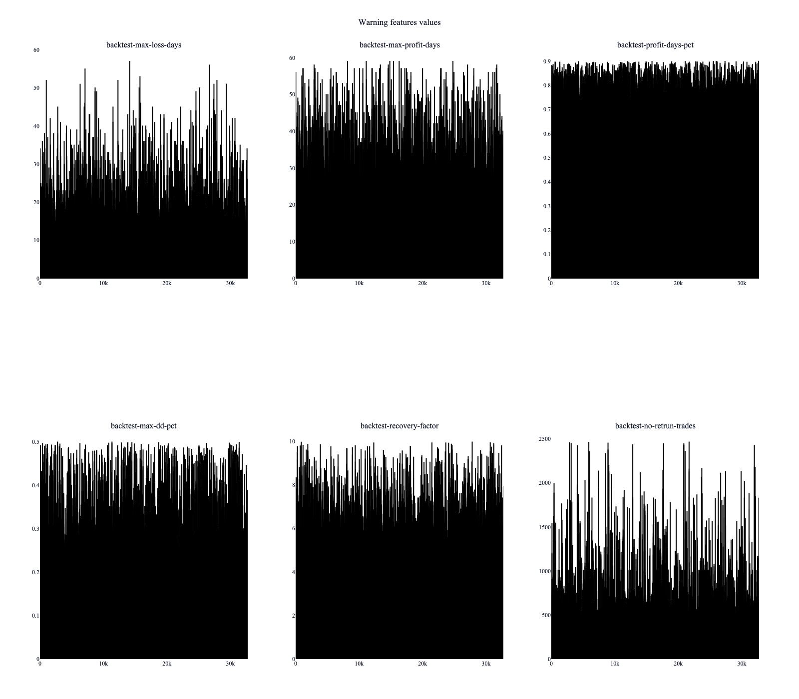
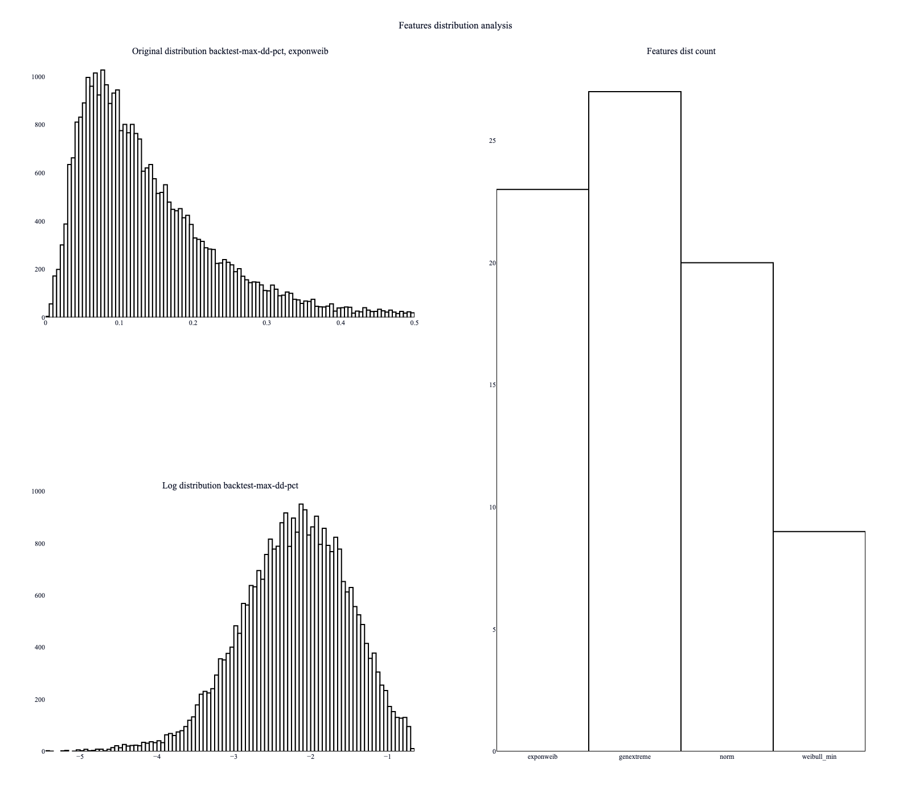
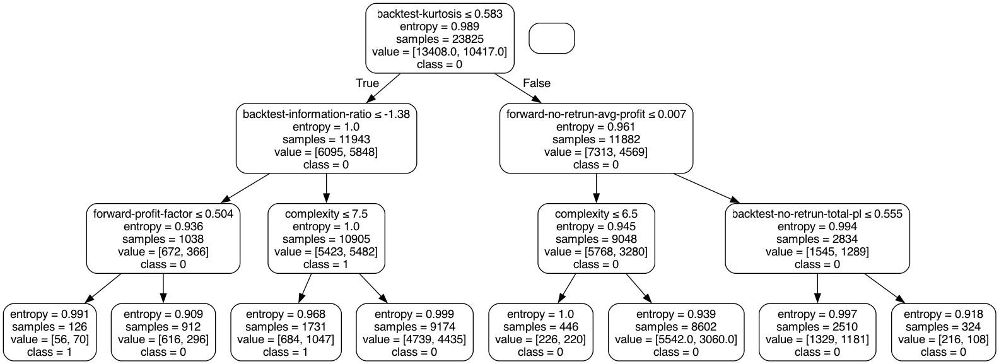
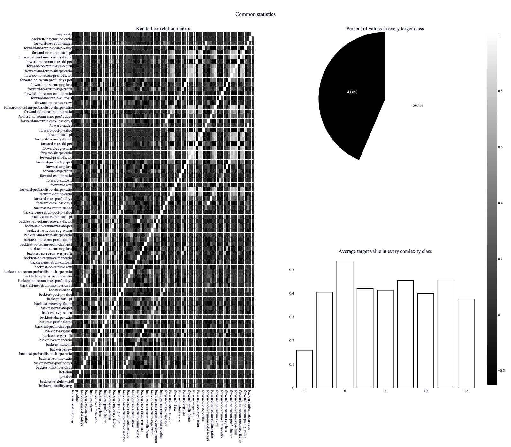
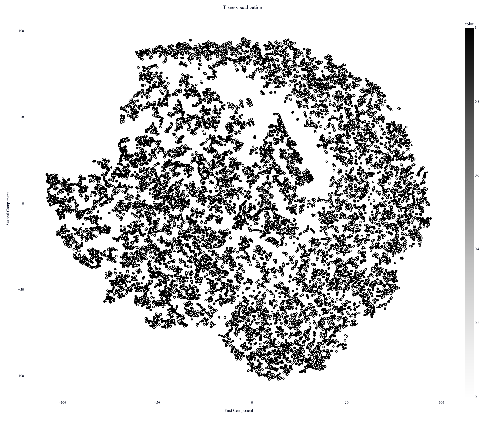

# Описание задачи
Проект посвящен определению валидных алгоритмов для торговли на финансовом рынке. Существует множество торговых алгоритмов **A**, которое мы пытаемся применить к множеству финансовых инструментов (акций) **B**. Каждый алгоритм из множества **А** запускается на каждой акции из множества **B**, после чего производится оптимизация параметров алгоритма и ряд статистических тестов, определяющих вероятности overfit-a и формирующие набор метрик, по которым мы должны понять, валиден ли алгоритм и можно ли применять его к данным. 

Итоговый датасет, по которому строится модель, представляет из себя набор метрик по каждому алгоритму, примененному к каждой акции. Алгоритмов в выборке 51, в то время как акций больше 500. В датасет попадают только те алгоритмы, которые после этапа оптимизации прошли через предварительную валидацию (набор эвристик, которые могут сразу отсеять невалидные алгоритмы). Часть метрик в датасете намеренно обфусцирована.

# Анализ данных и построение модели
Исходные датасет описан в файле с описанием проекта. За манипуляцию данными отвечает класс DataProvider.

- После анализа описательной статистики были выявлены наблюдения с логическими аутлаерами. Эти аутлаеры залогированы и отправлены на анализ, из исходного датасета они удалены без применения математических методов, при помощи определения threshold-ов.

- Для всех фич построено примерное теоретическое распределение, которое в подавляющем большинстве случаев не соответствует нормальному. Есть фичи, в которых распределение похоже на маржинальное. Далее в целях нормализации для некоторых моделей, которые исходят из предположения о нормальности распределения, использован QuantileTransformer. 

- Следующим шагом было построего DecisionTree на необработанных данных. Если применить эту модель к исходным необработанным данным, то получим accuracy 0.58. Эту модель возьмем за бенчмарк, она вычленяет хорошие алгоритмы с вероятностью более 50% и очень хорошей интерпретабельностью. Анализ дерева показал фичи, деление по которым ведет к кластеру с большой вероятностью получения хороших стратегий. Это послужило выставлению гипотезы о том, что нам нужно фильтровать алгоритмы по сложности для улучшения будущей модели. 
 

- У данных большая размерность, линейная зависимость есть только у переменных, которые имеют общую логику рассчета, для первичного анализа была построена матрица корреляций Кендалла без сдвига. Также была проанализирована диаграмма по среднему таргету в зависимости от грейда сложности алгоритма. Было решено отфильтровать самые просты и самые сложные алгоритмы, так как в среднем эти алгоритмы чаще других попадают в категорию невалидных. Помимо этого, такая фильтрация легко поддается теоретической интерпретации.    На круговой диаграмме видно распределение таргет-значений в процентах. 

Следующим шагом была построена T-distributed Stochastic Neighbor Embedding модель и визуализирован результат. В основном предпочтение этому методу на Principal Component Analysis было отдано из-за способности к обнаружению нелинейных зависимостей. Явных кластеров, к сожалению не нашлось. 
 

В целом на этом этапе у нас есть модель с возможностью интерпретировать ее решения.

Далее я попробовал пожертвовать интерпретабельностью и построить instance-based model, так как теоретически такая модель должна была давать лучший результат. В этой связи было решено использовать bagging из 10 Support Vector Machine моделей с использованием Radial Basis Function в качестве kernel-trick-a. Гиперпараметры модели не оптимизировались, в модель передавались данные, обработанные QuantileTransformer. Accuracy такой модели ~ 0.64. 

# Итоги

В данный момент оба подхода проходят проверку на альтернативыных датасетах. 

# TODO:

Также есть ряд гипотез, которые могут улучшить модель: 
- Помимо information ratio есть еще одна очень важная метрика, которая может улучшить прогностическую способность алгоритма, - это Hurst Exponent coef, который помогает отделить стационарный временной ряд от нестационарного. Его следует применять к временному ряду underlying-a. Визуальное сопоставление графиков и коэфициента наталкивает на мысль, что эта переменная может помочь отделить алгоритмы, которые оптимизировались на временном ряде с определенными ярковырежнными характеристиками (трендом) и отфильтровать такие стратегии.
- Возможно стоит оптимизировать гиперпараметры для instance-based model, ввести тесты на валидность модели и внимательно изучить исходные графики false-positive этой модели. 
- Стоит попробовать catboost, переразметить данные и сделать вероятностный аутпут, после чего использовать его как метрику для дальнейшей фильтрации.
